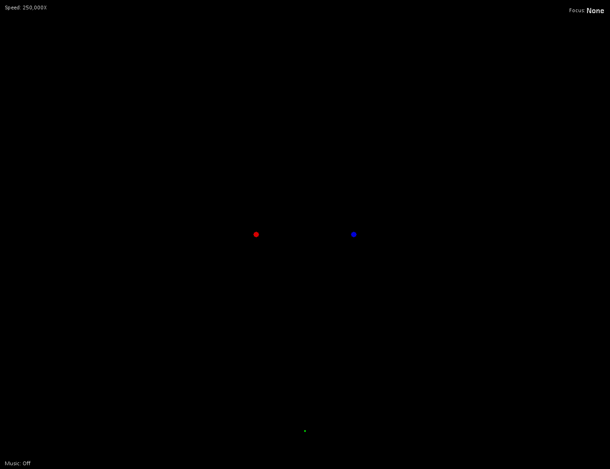

# 2dGraviPy

Simple 2d gravity simulator using PyGame

Simulate the newtonian gravity laws. 

## Requirements:

* Python >= 3.6
* Pygame >= 1.9

## How to start:

```bash
python main.py
```


## Commands

| Key        | Action  |
|------------|---------|
|      +     | Speed up|
|      -     | Speed down|
|      F     | Draw lines of force applied on each body|
|      G     | Draw the ghost of the bodies (previous positions)|
|      S     | Toggle the scale visibility in the bottom left corner |
|      V     | Toggle music |
|      U     | Set current scale to 1 UA|
| Left click | Select an object and show the info about it |
| Right click| Focus the view on the clicked body|
| Mouse wheel| Zoom (in/out)|


##  Preview

Solar system:


Dual stars system
