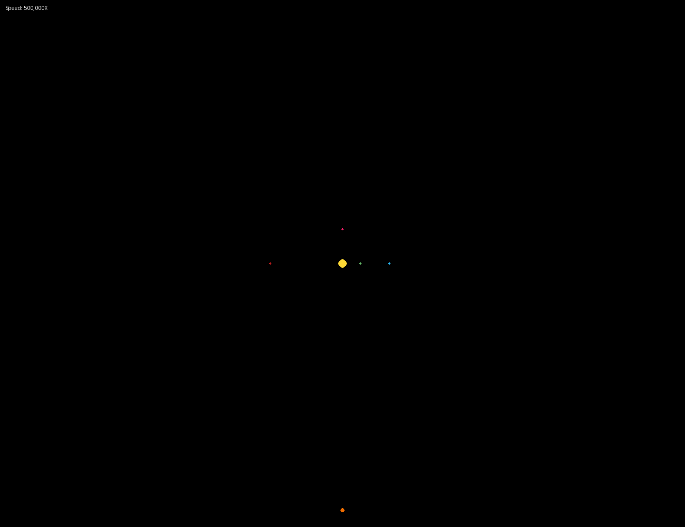

# 2dGraviPy

Simple 2d gravity simulator using PyGame

Simulate the newtonian gravity laws. By default, it simulate the Sun, Mercury, Venus, Earth, Mars and Jupiter 
with the real values (the starting position is not accurate, only the distance from the sun, the mass & the initial speed are)

## Requirements:

* Python >= 3.6
* Pygame >= 1.9

## How to start:

```bash
python main.py
```


## Commands

| Key | Action  |
|-----|---------|
|  +  | Speed up|
|  -  | Speed down|
|  F  | Draw line of force applied on each body|
|  G  | Draw the ghost of the bodies (prefious positions)|

##  Preview

